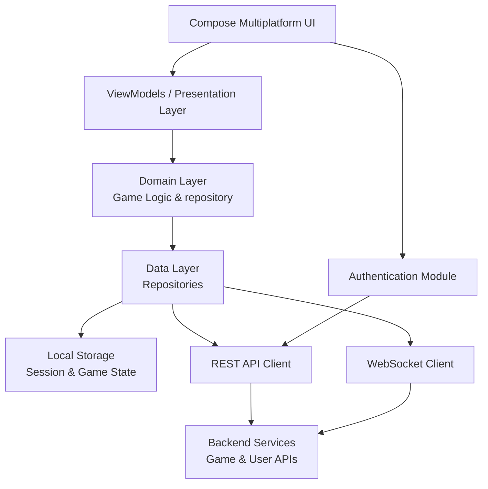

# SpadeBreak Live Front-end

SpadeBreak Live Front-end is a real-time multiplayer game application inspired by CallBreak card game built using Kotlin Multiplatform (KMP) to deliver a unified and consistent gaming experience across Android and ios platforms. The application communicates with the SpadeBreak backend through WebSockets and REST APIs to provide low-latency game state updates, player actions, and live interactions with a responsive and modern UI.

This repository contains the complete front-end source code for the SpadeBreak Live platform.

## Features

SpadeBreak Live Front-end offers a range of features for developers and players:

-**Real-time Multiplayer Gameplay:** Live game state synchronization using WebSockets for instant player actions, card distribution, and round updates with low latency.

-**Cross-Platform Support (KMP):** Single codebase targeting Android and Desktop using Kotlin Multiplatform and Compose Multiplatform UI.

-**Dynamic Game UI & Animations:** Smooth card movements, Lottie-based reactions, and animated chat bubbles displayed near player profiles for immersive gameplay.

-**Reactive State Management:** Predictable UI state handling using structured game states (RoundState, PlayerState, GameEvents) to ensure consistency across devices.

-**In-Game Chat & Reactions:** Real-time chat messages and reaction animations triggered through WebSocket events and rendered contextually near players.

-**User Authentication:** Secure login flow with session persistence and backend validation for multiplayer rooms.

-**Adaptive Layout System:** Responsive and adaptive UI that adjusts player positions and game layout for different screen sizes on mobile and desktop.

-**Local Storage & Session Persistence:** Local storage handling to preserve user sessions, game progress, and UI state for a smoother and uninterrupted user experience.

-**Full Game Lifecycle Management:** Manages complete game flow including room creation, player joining, betting phase, card play, round transitions, and game completion states.

-**Backend Integration:** Seamless integration with REST APIs and WebSocket endpoints for game logic, room management, and player interactions.

-**Error Handling & Network Resilience:** Graceful handling of network failures, invalid states, and backend errors with user-friendly feedback.

-**Modular Clean Architecture:** Well-structured layers (presentation, domain, data, core) for maintainability, scalability, and testability.

-**Performance Optimized UI:** Efficient rendering and state updates to ensure smooth gameplay even during high-frequency real-time events.

## Architecture Overview

Below is a high-level overview of the core components and data flow in the SpadeBreak Live Front-end application.

---
## Kotlin Multiplatform Development Features

This section highlights the key Kotlin Multiplatform tools, architectural patterns, and reactive frameworks used to build a scalable real-time front-end application:

-**Kotlin Multiplatform (KMP):** Shared business logic and state management across Android and Desktop platforms from a single codebase.

-**MVI Architecture (Model–View–Intent):** Unidirectional data flow using Intent → State → UI rendering, ensuring predictable state management and easier debugging for complex real-time game interactions.

-**Kotlin Flow & Coroutines:** Reactive streams and asynchronous programming for handling real-time WebSocket events, API responses, and continuous game state updates.

-**Compose Multiplatform UI:** Declarative UI framework for building responsive and adaptive user interfaces across platforms.

-**Ktor Client:** Networking layer for REST API communication and WebSocket connections with backend services.

-**Koin Dependency Injection:** Lightweight dependency injection for managing ViewModels, repositories, use cases, and networking modules.

-**Local Storage & Persistence:** Session and game lifecycle persistence to maintain user state and ensure continuity across app restarts.

-**Serialization (kotlinx.serialization):** Structured parsing of game states, player data, and network messages.

-**Modular Clean Architecture:** Separation of concerns using presentation, domain, data, and core layers for scalability, maintainability, and testability.
